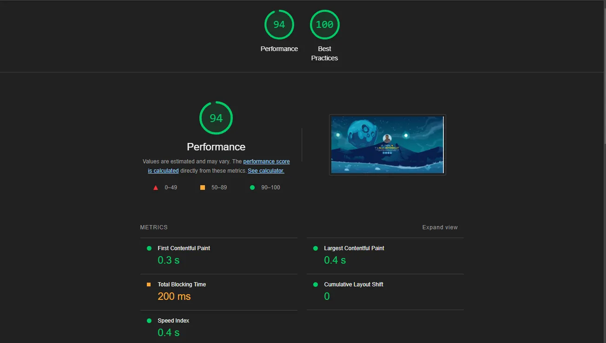

# Akın BÜYÜKBULUT Portfolio Website 

Hello there! I'm Akın Büyükbulut, a software developer. This repository is dedicated to my portfolio website [aknbb.github.io](https://aknbb.github.io) where I showcase my projects and skills.

### Technologies Used

* HTML5
* CSS3
* JavaScript (ES6)
* three.js 0.126.0
* Bootstrap 5.3.2
* Modernizr 2.6.2
* Pure WebGL
* Font Awesome 
* Webpack 5

### Performance Score (Google Lighthouse)

Feel free to explore my portfolio and get in touch if you have any questions or collaboration ideas. You can reach out to me via [akinbuyukbulut@gmail.com](mailto:akinbuyukbulut@gmail.com) or connect with me on [LinkedIn](https://www.linkedin.com/in/akinbuyukbulut/) and [GitHub](https://github.com/Aknbb).
